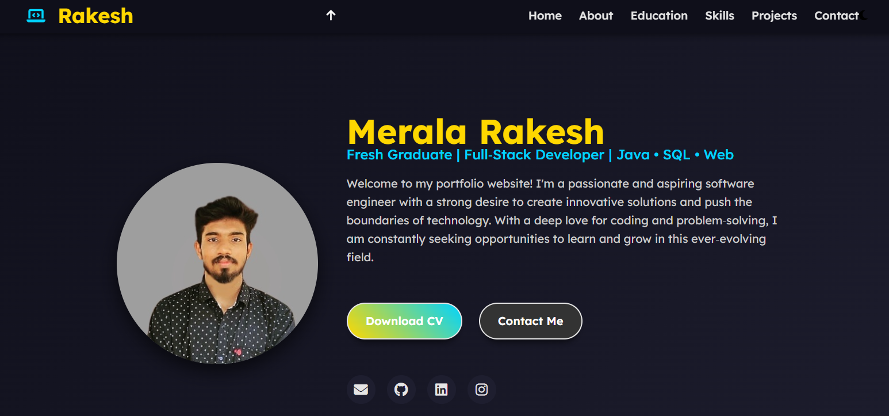
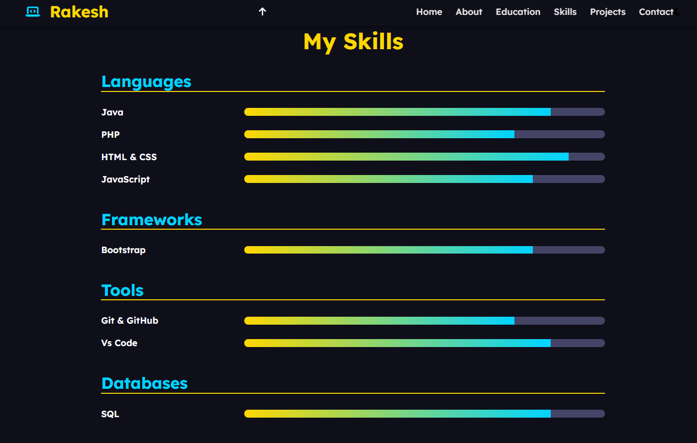
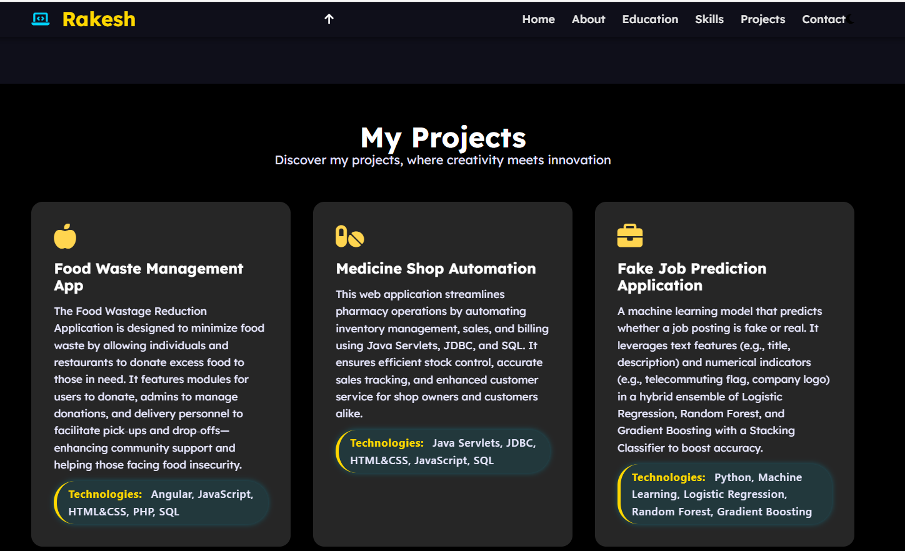

# 📌 Portfolio Rakesh

Welcome to **Portfolio Rakesh** — a personal portfolio website that showcases my skills, projects, and professional presence online. Built with simplicity and responsiveness in mind, this site is aimed at creating a strong first impression for recruiters, collaborators, and anyone interested in my work.

🌐 **Live Demo:** [Click here to view the site](https://portfolio-rakesh16.netlify.app/)

---

## 🚀 Technologies Used

- **HTML**
- **CSS**
- **JavaScript**

---

## 🎯 Features

- Responsive design for mobile, tablet, and desktop
- Smooth animations and transitions
- Project showcase section with interactive UI
- Contact section with direct links to social profiles and email
- Lightweight and fast loading

---

## 📸 Preview
## 📸 Screenshots

Here are some screenshots of the portfolio website to give you a glimpse of its look and feel:

  
*The homepage features a clean navigation bar, a welcoming hero section with an introduction, and quick links to important sections.*

  
*Skills section displaying my key technical skills with visually appealing icons and progress bars.*

  
*Projects section highlighting interactive project cards with brief descriptions, technologies used, and links to live demos or source code.*


---

## 🛠️ Installation

If you'd like to run the portfolio locally:

```bash
git clone https://github.com/Rakeshmerala16/your-repo-name.git
cd your-repo-name
open index.html in your browser
